# sports-quant

[](https://github.com/thadhutch/sports-quant/actions/workflows/ci.yml)
[](https://pypi.org/project/sports-quant/)
[](https://www.python.org/downloads/)
[](LICENSE)

An end-to-end data pipeline that scrapes [PFF](https://www.pff.com/) team grades and [Pro Football Reference](https://www.pro-football-reference.com/) game/betting data, builds analysis-ready datasets, and trains an ensemble XGBoost model for NFL over/under prediction.

<p align="center">
  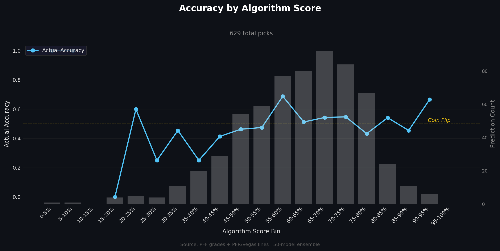
</p>

---

## Table of Contents

- [Features](#features)
- [Installation](#installation)
- [Prerequisites](#prerequisites)
- [Configuration](#configuration)
- [Usage](#usage)
  - [CLI](#cli)
  - [Python API](#python-api)
  - [Make Targets](#make-targets)
- [Pipeline Architecture](#pipeline-architecture)
- [Modeling](#modeling)
- [Example Charts](#example-charts)
- [Project Structure](#project-structure)
- [Development](#development)
- [Contributing](#contributing)
- [Known Limitations](#known-limitations)
- [License](#license)

---

## Features

- **PFF Scraping** &mdash; Selenium-based scraper for PFF team grades (requires PFF Premium; manual login on first run, cookies cached for subsequent runs)
- **PFR Scraping** &mdash; Proxy-rotated scraper for Pro Football Reference boxscores
- **Data Normalization** &mdash; Standardizes dates and team names across sources
- **Dataset Merging** &mdash; Inner join on date + team columns
- **Rolling Averages** &mdash; Pre-game cumulative stat averages per team per season
- **Games Played Tracking** &mdash; Cumulative games played before each matchup
- **Feature Rankings** &mdash; Per-date rankings across all teams
- **Ensemble Training** &mdash; Trains 50 XGBoost models per game-day, selects top 3 by weighted seasonal accuracy, requires consensus agreement, and runs a financial simulation
- **Walk-Forward Backtesting** &mdash; Trains 50 models across every historical date using walk-forward validation and averages metrics across all models
- **CLI + Python API** &mdash; Run the full pipeline or any individual step

## Installation

Install from [PyPI](https://pypi.org/project/sports-quant/):

```bash
pip install sports-quant
```

Or install from source with [Poetry](https://python-poetry.org/):

```bash
git clone https://github.com/thadhutch/sports-quant.git
cd sports-quant
poetry install
```

## Prerequisites

| Requirement | Why |
|---|---|
| Python 3.12+ | Runtime |
| Google Chrome | PFF scraper uses Selenium to render client-side data |
| [PFF Premium](https://www.pff.com/) subscription | Authenticates access to PFF team grades |
| Rotating proxies (CSV) | PFR rate-limits aggressively; proxies prevent blocks |

## Configuration

Create a `.env` file (see [`.env.example`](.env.example)) or export environment variables directly:

```bash
cp .env.example .env
```

| Variable | Default | Description |
|---|---|---|
| `NFL_SEASONS` | `2025` | Comma-separated seasons to scrape from PFF |
| `NFL_START_YEAR` | `2025` | First year for PFR boxscore URL collection |
| `NFL_END_YEAR` | `2025` | Last year for PFR boxscore URL collection |
| `NFL_MAX_WEEK` | `18` | Final week to scrape in the last season |
| `NFL_DATA_DIR` | `data` | Base directory for all output files |
| `NFL_PROXY_FILE` | `proxies/proxies.csv` | Path to proxy list (`address:port:user:password` per line) |
| `NFL_MODEL_CONFIG` | `model_config.yaml` | Path to model configuration file |

Model hyperparameters and training settings are configured in `model_config.yaml`:

```yaml
ou:
  model_version: "v1"        # Version tag for output directories
  models_to_train: 50        # Number of models per ensemble
  top_models: 3              # Models kept after selection
  accuracy_threshold: 0.50   # Minimum validation accuracy
  model_weights: [0.4, 0.35, 0.25]  # Consensus weighting
  starting_capital: 100.0    # Simulation starting capital ($)
  hyperparameters:
    objective: "multi:softprob"
    num_class: 3
    eval_metric: "mlogloss"
  backtest:
    min_training_seasons: 2
    test_size: 0.8
  train:
    test_size: 0.2
```

## Usage

### CLI

The `sports-quant` command is available after installation.

> **Note:** The first time you run `sports-quant scrape pff`, a Chrome window will open for you to log in to PFF manually. After login, cookies are saved locally and reused for future runs.

```bash
# Full end-to-end pipeline
sports-quant pipeline

# Scrape from a single source
sports-quant scrape pff          # PFF grades (scrape + date parsing + name normalization)
sports-quant scrape pfr          # PFR game data (URLs + scrape + date/name normalization)

# Run all post-processing steps
sports-quant process all

# Run individual processing steps
sports-quant process merge
sports-quant process over-under
sports-quant process averages
sports-quant process games-played
sports-quant process rankings

# Modeling
sports-quant model train       # Train ensemble O/U prediction model
sports-quant model backtest    # Run walk-forward backtesting

# Check installed version
sports-quant --version
```

### Python API

Every pipeline step is importable:

```python
import sports_quant

# Scraping
sports_quant.scrape_pff_data()
sports_quant.collect_boxscore_urls()
sports_quant.scrape_all_game_info()

# Processing
sports_quant.merge_datasets()
sports_quant.process_over_under()
sports_quant.compute_rolling_averages()
sports_quant.add_games_played()
sports_quant.compute_rankings()

# Modeling
sports_quant.run_training()
sports_quant.run_backtest()
```

Or run an entire pipeline at once:

```python
from sports_quant.pipeline import (
    run_full_pipeline,
    run_pff_pipeline,
    run_pfr_pipeline,
    run_processing_pipeline,
)

run_full_pipeline()        # end-to-end
run_pff_pipeline()         # PFF scraping chain only
run_pfr_pipeline()         # PFR scraping chain only
run_processing_pipeline()  # post-processing only
```

### Make Targets

A `Makefile` is included for common development workflows:

```bash
make all            # Full pipeline end-to-end
make pff            # PFF scraping + processing chain
make pfr            # PFR scraping + processing chain
make merge          # Merge PFF and PFR data (runs both chains first)
make rankings       # Full postprocessing through rankings
make model-train    # Train ensemble O/U prediction model
make model-backtest # Run walk-forward backtesting
make test           # Run the test suite
make clean          # Remove all generated data files
make dirs           # Create data directory structure
```

## Pipeline Architecture

```
PFF Scrape              PFR Scrape
    |                       |
    v                       v
Extract Dates          Normalize Dates
    |                       |
    v                       v
Normalize Names        Normalize Names
    |                       |
    +----------+   +--------+
               |   |
               v   v
              Merge
                |
                v
           Over/Under
                |
                v
         Rolling Averages
                |
                v
          Games Played
                |
                v
            Rankings
                |
       +--------+--------+
       |                  |
       v                  v
  Model Train        Backtest
  (ensemble)       (walk-forward)
```

**Output files** are written to `NFL_DATA_DIR` (default: `data/`):

| Stage | Output |
|---|---|
| PFF scrape | `data/pff/raw_team_data.csv` |
| PFF normalized | `data/pff/normalized_team_data.csv` |
| PFR URLs | `data/pfr/boxscores_urls.txt` |
| PFR normalized | `data/pfr/final_pfr_odds.csv` |
| Merged | `data/pff_and_pfr_data.csv` |
| Final dataset | `data/over-under/v1-dataset-gp-ranked.csv` |
| Training output | `data/models/{version}/algorithm/` |
| Backtest output | `data/backtest/{version}/` |

## Modeling

### How It Works

The core idea is simple: **don't try to predict every game &mdash; find the games where the model is reliably right, and only bet those.**

On each game-day the pipeline trains 50 XGBoost models with different random seeds on all available historical data. Most of those models are mediocre. The pipeline filters to the top 3 based on a weighted seasonal accuracy score (heavier weight on the current season, lighter on last season), then requires all three to agree on a pick before it counts. Each consensus pick gets an *algorithm score* &mdash; a weighted blend of each model's per-bin confidence accuracy &mdash; that captures how well the ensemble has historically performed at that confidence level.

$$S = \sum_{i=1}^{N} w_i \cdot A_i$$

$$A_i = \alpha \cdot \text{acc}_{i,\,c,\,b} \;+\; (1 - \alpha) \cdot \text{acc}_{i,\,c-1,\,b}$$

$$\alpha = \text{clamp}\!\bigg(\frac{d_{\text{elapsed}}}{d_{\text{total}}},\; 0,\; 1\bigg)$$

where

- $N$ = number of top models kept after selection (hyperparameter)
- $w_i$ = ensemble weight for model $i$ (configured in `model_config.yaml`)
- $A_i$ = adjusted score for model $i$
- $\text{acc}_{i,s,b}$ = model $i$'s historical accuracy in confidence bin $b$ for season $s$
- $b$ = confidence bin of the prediction (binned from $\max(\hat{p})$)
- $c$ = current season
- $d_{\text{elapsed}}$ = days since Sep 1, &ensp; $d_{\text{total}}$ = days from Sep 1 to Jan 15

The chart at the top of this README tells the story: across 629 total picks, accuracy rises as the algorithm score increases, crossing above coin-flip around the 50% bin and climbing into the 60&ndash;70%+ range at higher bins. Most picks cluster in the middle of the distribution (the grey bars), but the profitable edge lives in the tails.

The heatmap below shows that this isn't a one-season fluke. Higher algorithm-score bins tend to stay green (accurate) across multiple seasons, while lower bins stay red:

<p align="center">
  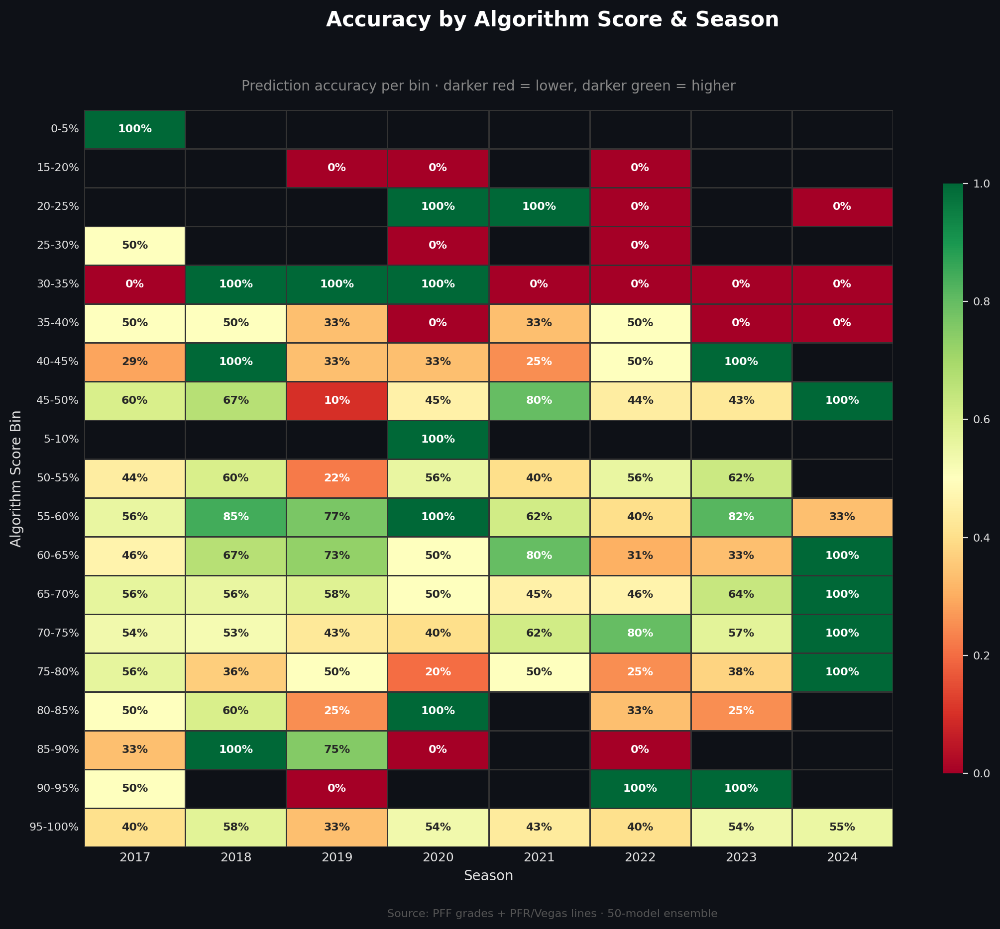
</p>
### Technical Details

| Parameter | Value |
|---|---|
| Models trained per game-day | 50 |
| Models kept after selection | Top 3 by weighted seasonal accuracy |
| Consensus requirement | All 3 must agree |
| Algorithm score | Weighted blend of per-model confidence-bin accuracy (0.4 / 0.35 / 0.25) |
| Bet sizing | 1% Kelly criterion |
| Starting simulation capital | $100 |

### Ensemble Training (`sports-quant model train`)

Outputs to `data/models/{version}/algorithm/`:
- `combined_picks.csv` &mdash; all consensus picks with algorithm scores
- Accuracy-by-confidence and accuracy-by-algorithm-score charts
- `cumulative_profit.png` &mdash; profit over time (units + dollars)
- `performance_statistics.txt` &mdash; best/worst day/week/month/year

### Walk-Forward Backtesting (`sports-quant model backtest`)

Evaluates model generalization using strict temporal separation: for each test date, train on all prior data, predict the current date, repeat across 50 random seeds, and average the metrics.

Outputs to `data/backtest/{version}/`:
- `average_season_accuracy.csv` + chart
- `average_confidence_accuracy.csv` + chart
- `average_confidence_accuracy_by_season.csv` + chart

## Example Charts

<p align="center">
  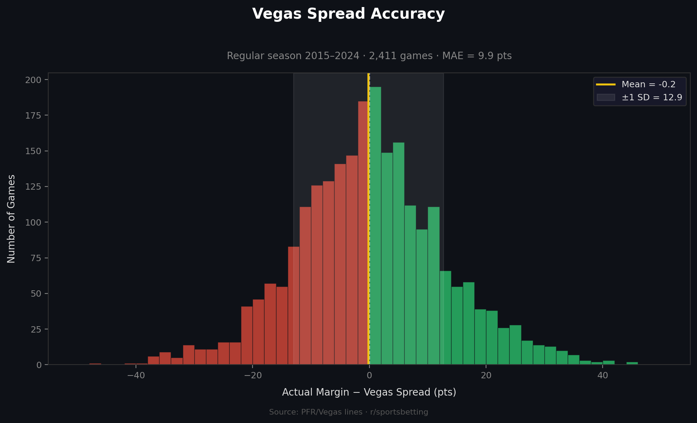
</p>

<p align="center">
  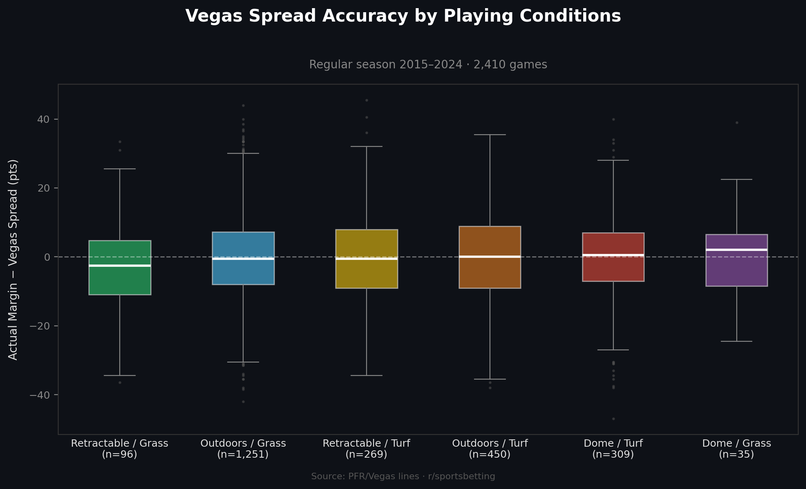
</p>

<p align="center">
  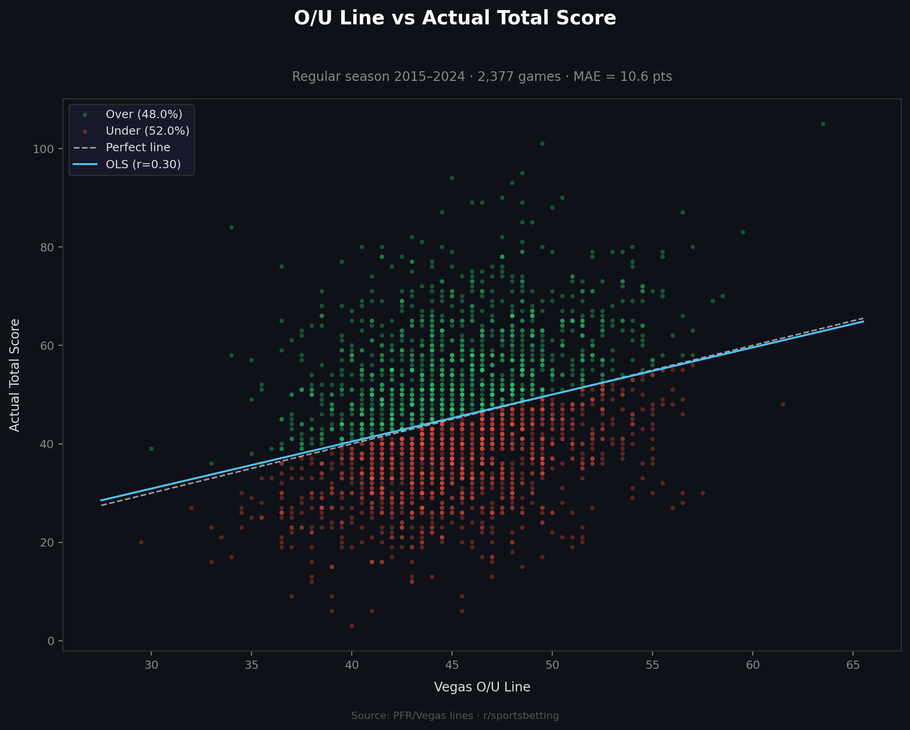
</p>

<p align="center">
  
</p>

<p align="center">
  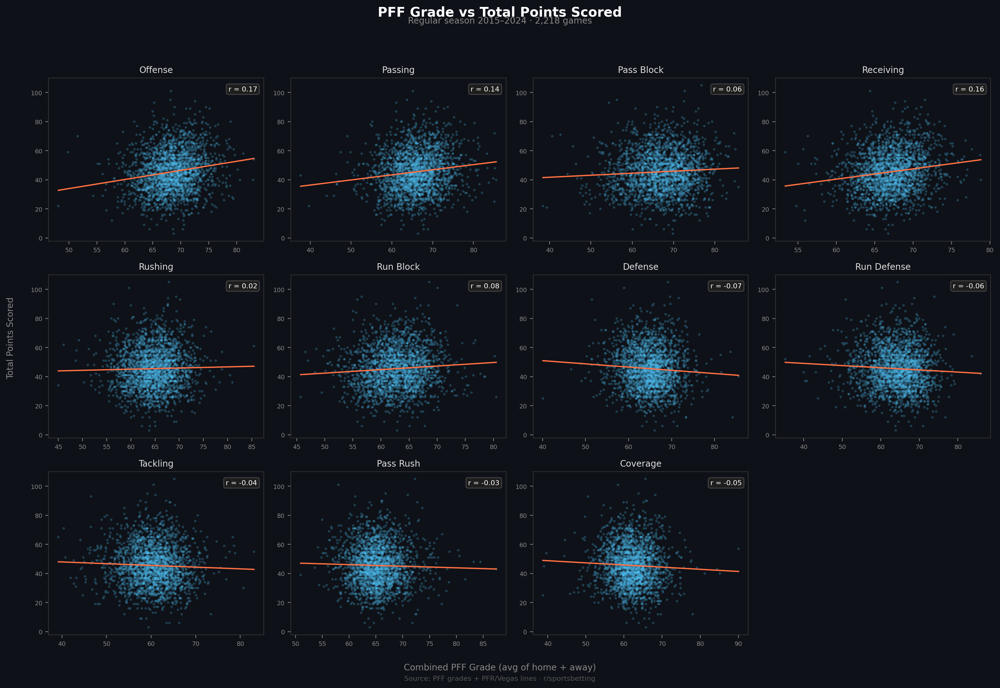
</p>

<p align="center">
  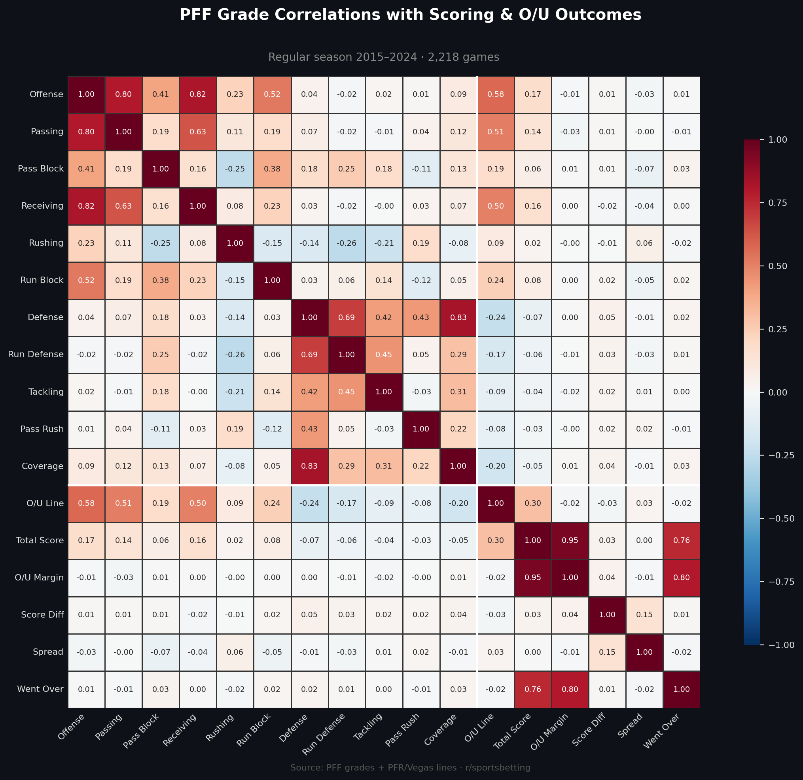
</p>

<p align="center">
  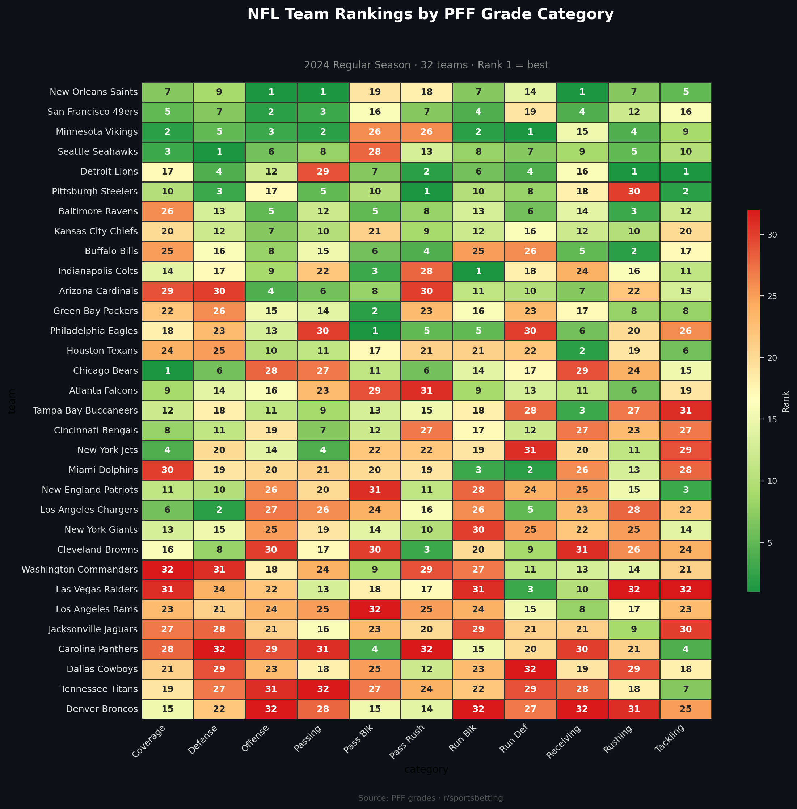
</p>

<p align="center">
  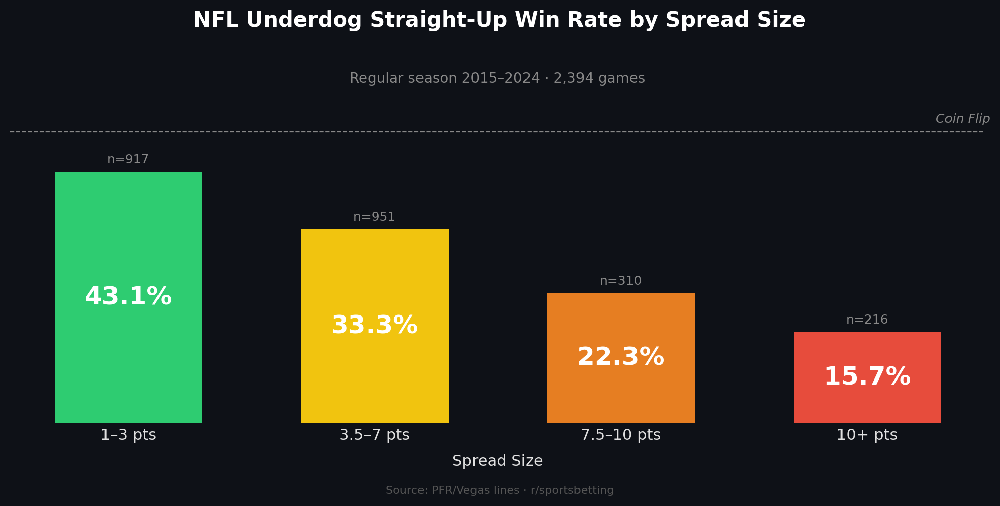
</p>

<p align="center">
  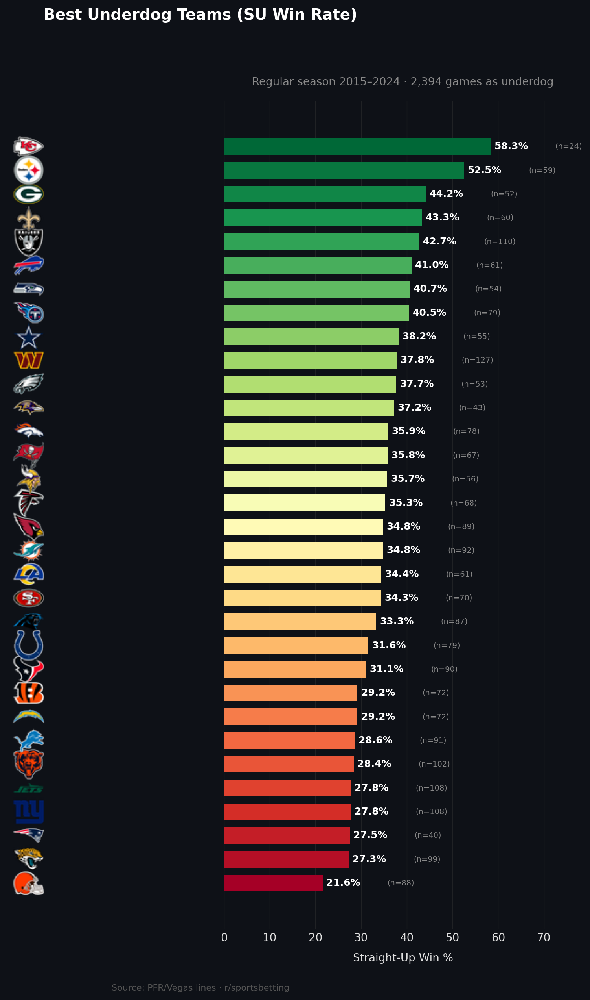
</p>

<p align="center">
  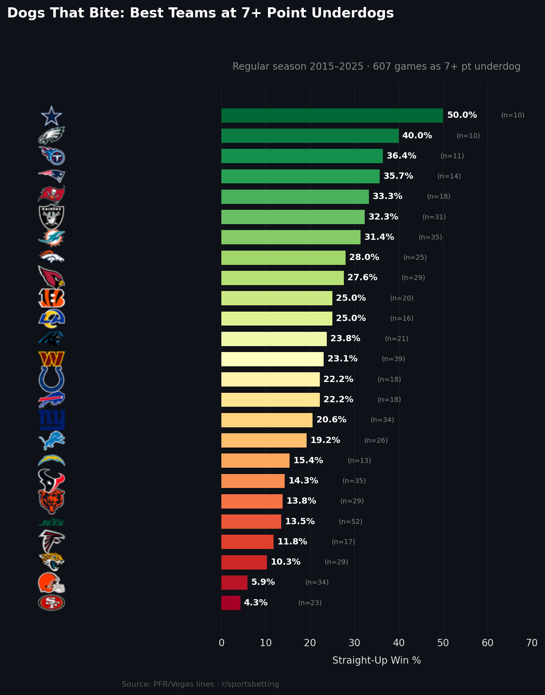
</p>

## Project Structure

```
sports-quant/
├── src/sports_quant/
│   ├── __init__.py           # Public API re-exports
│   ├── _config.py            # Paths, env vars, logging
│   ├── cli.py                # Click CLI entry point
│   ├── pipeline.py           # Pipeline orchestrators
│   ├── teams.py              # Team name/abbreviation mappings
│   ├── scrapers/
│   │   ├── pff.py            # PFF grades scraper (Selenium)
│   │   ├── pfr.py            # PFR game data scraper
│   │   ├── pfr_urls.py       # PFR boxscore URL collector
│   │   ├── auth.py           # PFF authentication
│   │   └── proxies.py        # Proxy loading utilities
│   ├── parsers/
│   │   ├── pff_dates.py      # PFF date extraction
│   │   ├── pff_teams.py      # PFF team name normalization
│   │   ├── pfr_dates.py      # PFR date normalization
│   │   └── pfr_teams.py      # PFR team name extraction
│   ├── processing/
│   │   ├── merge.py          # Merge PFF + PFR datasets
│   │   ├── over_under.py     # O/U betting line extraction
│   │   ├── rolling_averages.py
│   │   ├── games_played.py
│   │   └── rankings.py
│   └── modeling/
│       ├── __init__.py       # Public API (run_training, run_backtest)
│       ├── _features.py      # Shared feature definitions
│       ├── _data.py           # Data loading and preparation
│       ├── _training.py      # Single-model and ensemble training
│       ├── _scoring.py       # Season weighting, consensus, model selection
│       ├── _simulation.py    # Financial simulation / profit tracking
│       ├── train.py          # Ensemble training orchestrator
│       ├── backtest.py       # Walk-forward backtesting orchestrator
│       └── plots.py          # All modeling-related charts
├── tests/
├── model_config.yaml
├── pyproject.toml
├── Makefile
├── LICENSE
└── README.md
```

## Development

```bash
# Clone and install with dev dependencies
git clone https://github.com/thadhutch/sports-quant.git
cd sports-quant
poetry install

# Run the test suite
poetry run pytest -v

# Run a specific test file
poetry run pytest tests/test_rolling_averages.py -v
```

CI runs automatically on every push to `master` and on pull requests via [GitHub Actions](https://github.com/thadhutch/sports-quant/actions). Releases are published to PyPI through [Trusted Publishers](https://docs.pypi.org/trusted-publishers/).

## Contributing

Contributions are welcome! To get started:

1. Fork the repository
2. Create a feature branch (`git checkout -b feature/my-feature`)
3. Make your changes and add tests where appropriate
4. Run the test suite (`poetry run pytest -v`)
5. Commit your changes (`git commit -m "Add my feature"`)
6. Push to your fork (`git push origin feature/my-feature`)
7. Open a Pull Request

Please make sure all existing tests pass before submitting a PR.

## Known Limitations

- **PFF scraping is DOM-dependent.** The scraper relies on XPath selectors tied to PFF's frontend. If PFF changes their page structure, the selectors in `scrapers/pff.py` will need updating.
- **PFR scraping requires rotating proxies.** Without them, requests will be rate-limited and blocked.
- **The PFF scraper is slow by design.** It drives a real Chrome browser via Selenium because PFF renders data client-side.
- **PFF login requires manual interaction on first run.** A Chrome window will open for you to log in. Cookies are cached afterward, so subsequent runs are fully automated.
- **Data files are not tracked in git.** Run the pipeline to generate them, or bring your own data in the expected CSV format.

## License

This project is licensed under the [MIT License](LICENSE).

---

<p align="center">
  <a href="https://pypi.org/project/sports-quant/">PyPI</a> &middot;
  <a href="https://github.com/thadhutch/sports-quant/issues">Issues</a> &middot;
  <a href="https://github.com/thadhutch/sports-quant/actions">CI Status</a>
</p>
