# sports-quant

[](https://github.com/thadhutch/sports-quant/actions/workflows/ci.yml)
[](https://pypi.org/project/sports-quant/)
[](https://www.python.org/downloads/)
[](LICENSE)

March Madness bracket prediction and NFL over/under modeling.

<p align="center">
  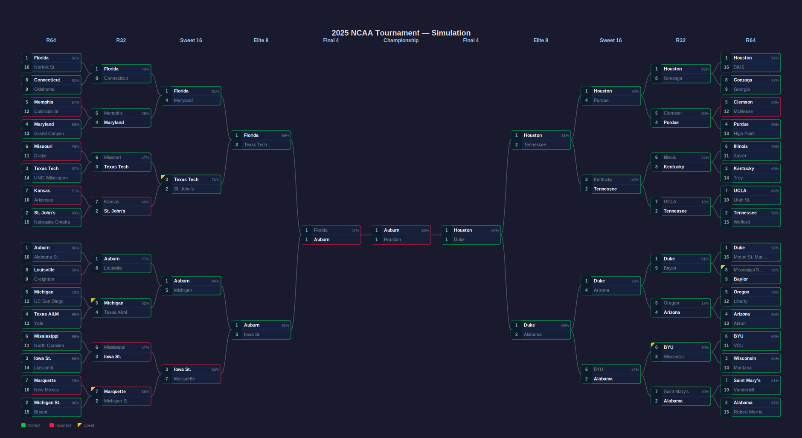
</p>

<p align="center"><em>2025 bracket prediction &mdash; 51 of 63 games correct (81.0%)</em></p>

---

## Model Highlights

|  |  |  |  |
|:---:|:---:|:---:|:---:|
| **81.0%** | **4 of 6** | **Back-to-Back** | **Called It** |
| bracket accuracy (2025) | champions correctly predicted | UConn champion picks (2023&ndash;2024) | NC State's Cinderella run (2024) |

---

## Year-by-Year Accuracy

Results from v6b LightGBM ensemble with forward simulation, backtested across 6 tournaments:

| Year | Accuracy | Correct / Total | Champion | Champion Correct? | Highlights |
|:----:|:--------:|:---------------:|:--------:|:-----------------:|:-----------|
| 2025 | **79.4%** | 50 / 63 | Florida (1) | No | Perfect Elite 8 (4/4), Sweet 16: 87.5% |
| 2024 | **76.2%** | 48 / 63 | UConn (1) | Yes | Perfect Final Four + National Championship |
| 2019 | **76.2%** | 48 / 63 | Virginia (1) | Yes | R32: 100% &mdash; perfect second round |
| 2022 | **71.4%** | 45 / 63 | Kansas (1) | Yes | Perfect Elite 8 (4/4) |
| 2021 | **67.7%** | 42 / 62 | Baylor (1) | No | Perfect Final Four |
| 2023 | **65.1%** | 41 / 63 | UConn (4) | Yes | F4 + NCG correct despite historically wild year |

**Average accuracy: 72.7%** across 6 tournaments (274 / 377 games)

---

## Upset Predictions

The model's best upset calls &mdash; games where a lower-seeded team was correctly predicted to win:

### 2024

| Round | Prediction | Seed Gap | Result |
|:-----:|:-----------|:--------:|:------:|
| R64 | **12 Grand Canyon** over 5 Saint Mary's | 7 | Correct |
| R64 | **11 NC State** over 6 Texas Tech | 5 | Correct &mdash; NC State went on a Cinderella run to the Final Four |
| S16 | **4 Alabama** over 1 North Carolina | 3 | Correct |

### 2023

| Round | Prediction | Seed Gap | Result |
|:-----:|:-----------|:--------:|:------:|
| NCG | **4 UConn** wins it all | &mdash; | Correct &mdash; a 4-seed national champion is rare |

### 2019

| Round | Prediction | Seed Gap | Result |
|:-----:|:-----------|:--------:|:------:|
| R64 | **12 Oregon** over 5 Wisconsin | 7 | Correct |

---

## How the March Madness Model Works

The March Madness model uses a **LightGBM ensemble** trained on historical tournament data with features derived from team performance metrics, seeding, and matchup interactions.

1. **Feature engineering** &mdash; KenPom ratings, Barttorvik T-Rank, seed-based statistics, conference strength, and matchup interaction features
2. **Ensemble prediction** &mdash; Multiple LightGBM models vote on each game's win probability
3. **Forward simulation** &mdash; The bracket is filled round-by-round, feeding predicted winners into the next round
4. **Seed debiasing** &mdash; Adjusts for historical seed-vs-seed upset rates to avoid over-favoring top seeds
5. **Backtesting** &mdash; Every prediction is out-of-sample; the model never sees future tournament results during training

### Survivor Pool Optimizer

The project also includes a **survivor pool optimizer** that uses the model's round-by-round probabilities to select optimal picks across multiple strategies:

- **Greedy** &mdash; Pick the highest-probability survivor each round
- **Bracket-aware** &mdash; Avoid picking teams from the same bracket side
- **Monte Carlo optimal** &mdash; Simulate thousands of scenarios to maximize expected survival

---

## NFL Over/Under Modeling

An end-to-end data pipeline that scrapes [PFF](https://www.pff.com/) team grades and [Pro Football Reference](https://www.pro-football-reference.com/) game/betting data, builds analysis-ready datasets, and trains an ensemble XGBoost model for NFL over/under prediction.

<p align="center">
  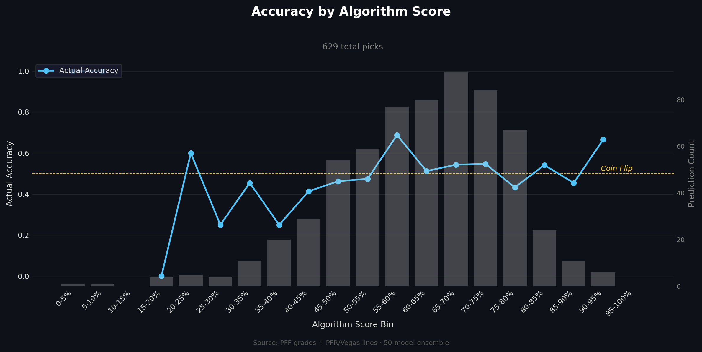
</p>

### How the NFL Model Works

The core idea is simple: **don't try to predict every game &mdash; find the games where the model is reliably right, and only bet those.**

On each game-day the pipeline trains 50 XGBoost models with different random seeds on all available historical data. The pipeline filters to the top 3 based on a weighted seasonal accuracy score, then requires all three to agree on a pick before it counts. Each consensus pick gets an *algorithm score* that captures how well the ensemble has historically performed at that confidence level.

<p align="center">
  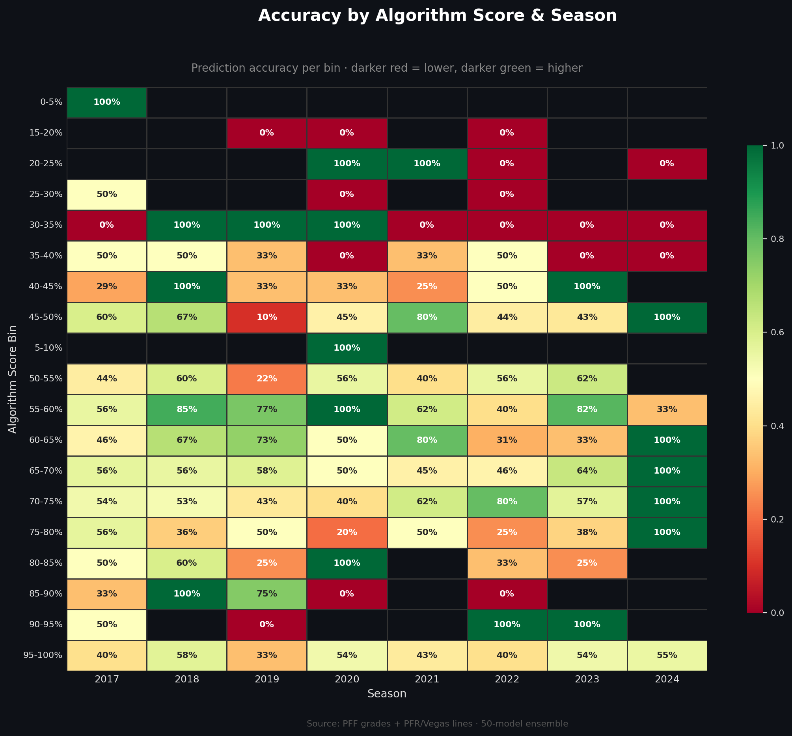
</p>

Higher algorithm-score bins tend to stay accurate across multiple seasons, while lower bins stay inaccurate.

### Technical Details

| Parameter | Value |
|---|---|
| Models trained per game-day | 50 |
| Models kept after selection | Top 3 by weighted seasonal accuracy |
| Consensus requirement | All 3 must agree |
| Algorithm score | Weighted blend of per-model confidence-bin accuracy (0.4 / 0.35 / 0.25) |
| Bet sizing | 1% Kelly criterion |
| Starting simulation capital | $100 |

### NFL Pipeline Architecture

```
PFF Scrape              PFR Scrape
    |                       |
    v                       v
Extract Dates          Normalize Dates
    |                       |
    v                       v
Normalize Names        Normalize Names
    |                       |
    +----------+   +--------+
               |   |
               v   v
              Merge
                |
                v
           Over/Under
                |
                v
         Rolling Averages
                |
                v
          Games Played
                |
                v
            Rankings
                |
       +--------+--------+
       |                  |
       v                  v
  Model Train        Backtest
  (ensemble)       (walk-forward)
```

### Example Charts

<details>
<summary><strong>Expand NFL charts</strong></summary>

<p align="center">
  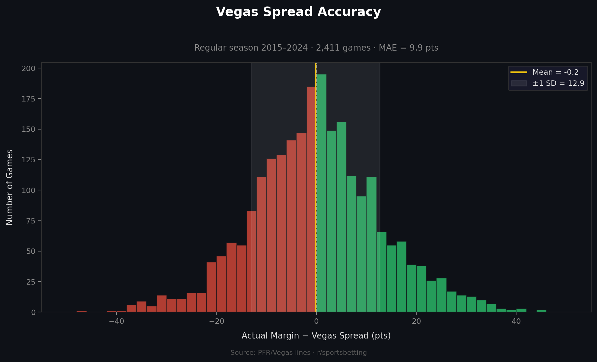
</p>

<p align="center">
  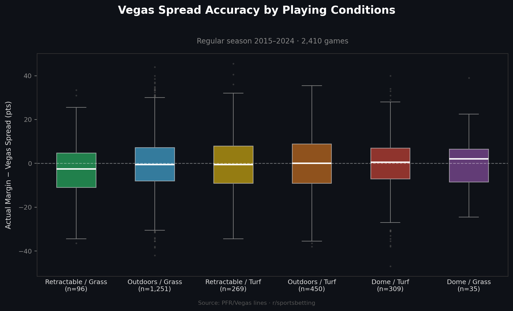
</p>

<p align="center">
  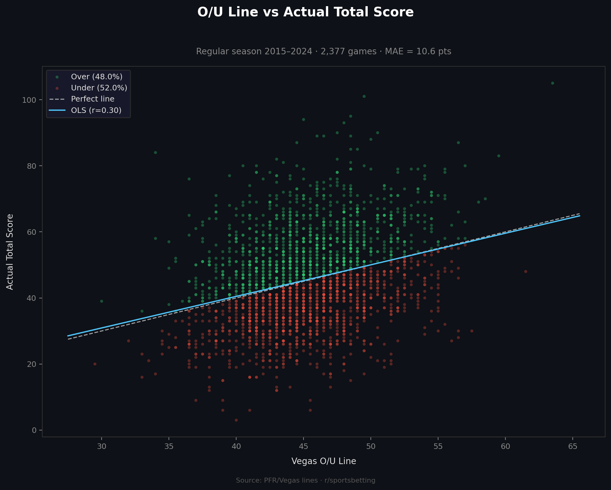
</p>

<p align="center">
  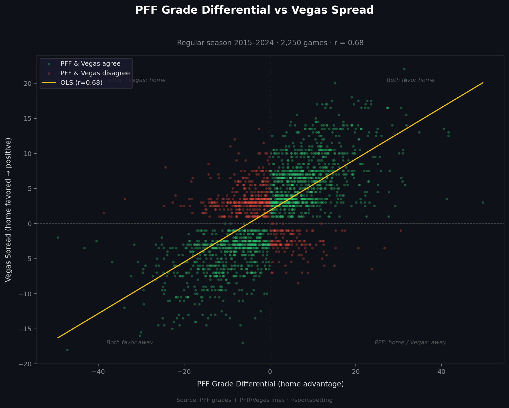
</p>

<p align="center">
  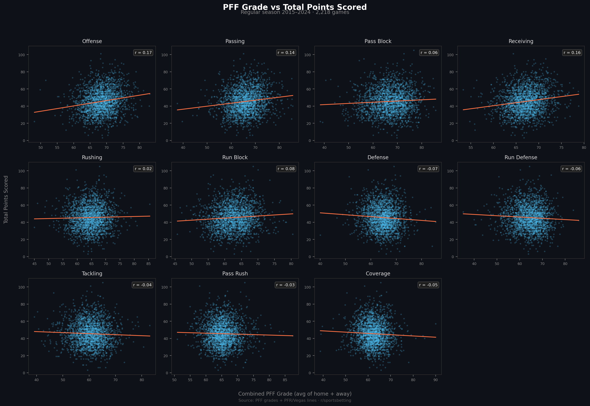
</p>

<p align="center">
  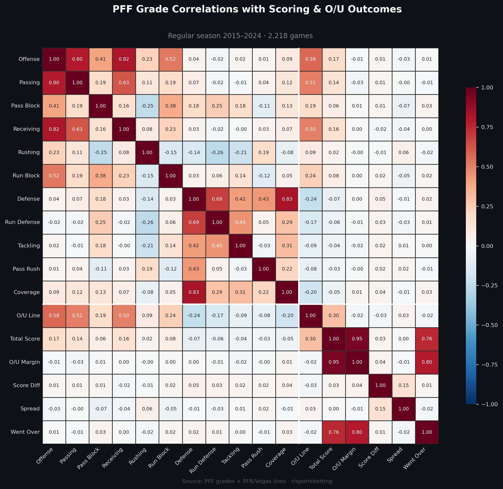
</p>

<p align="center">
  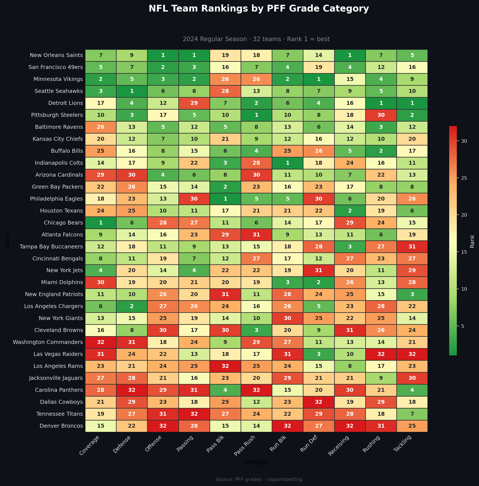
</p>

<p align="center">
  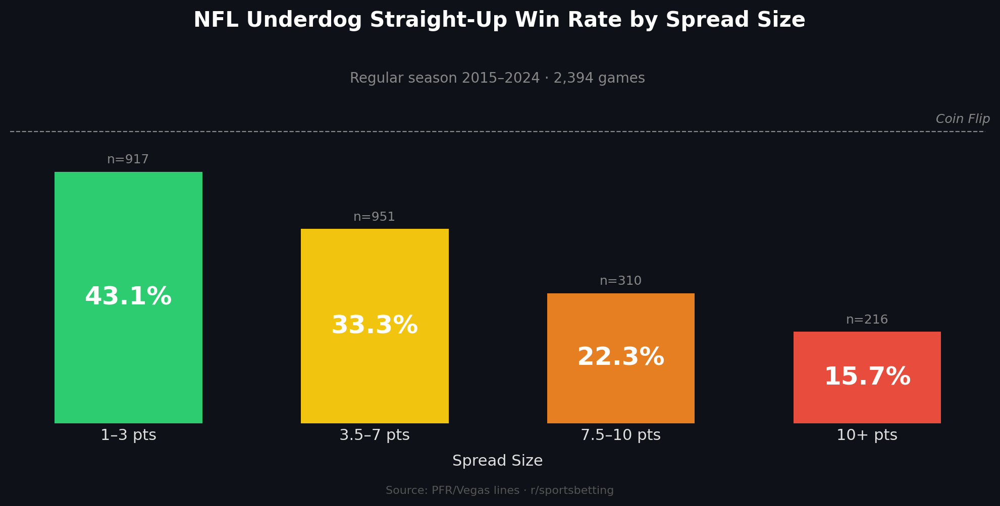
</p>

<p align="center">
  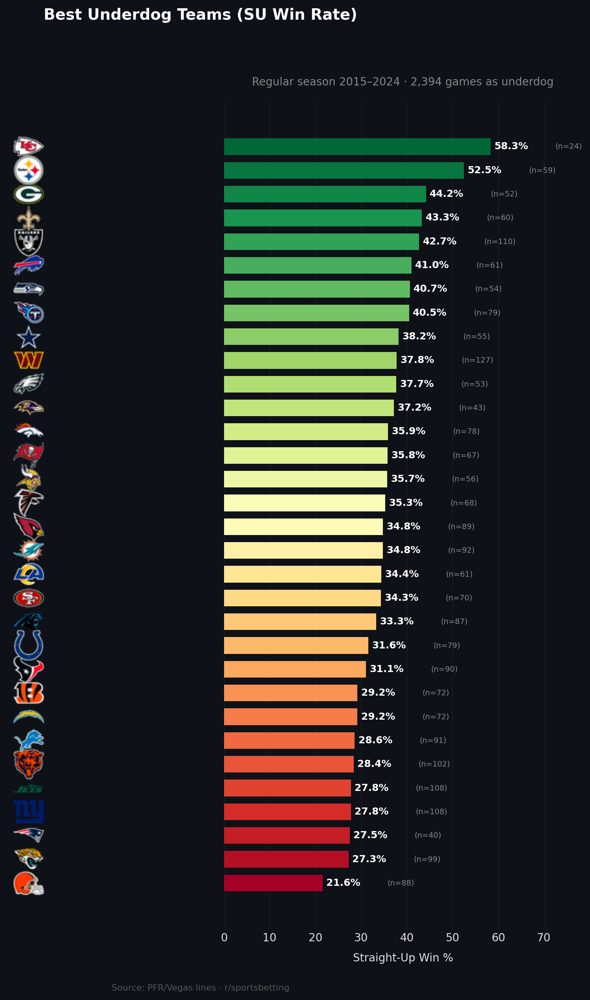
</p>

<p align="center">
  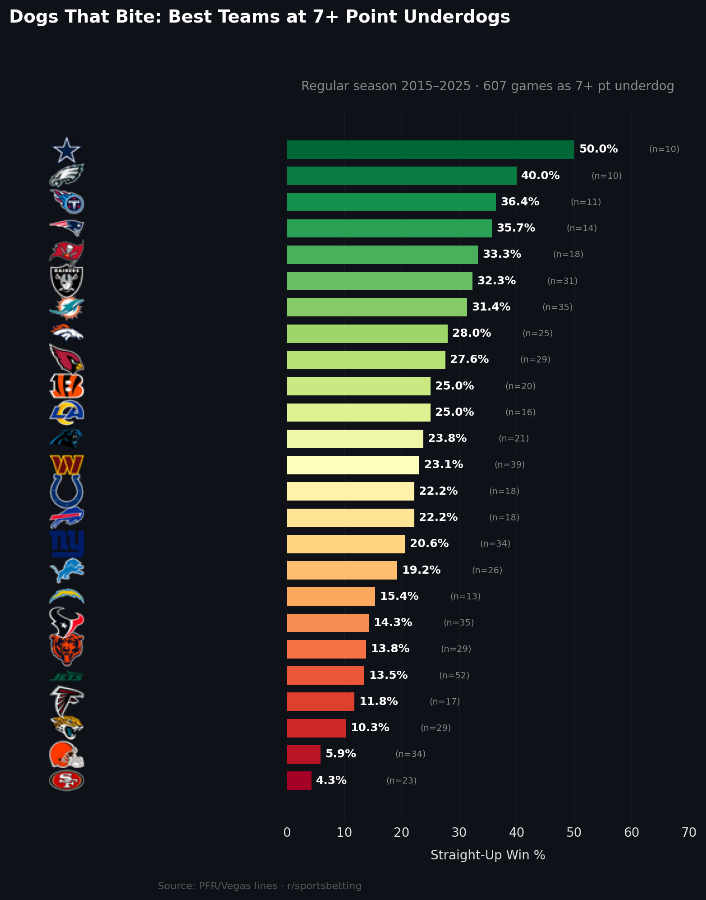
</p>

</details>

---

## Features

- **March Madness Bracket Prediction** &mdash; LightGBM ensemble with forward simulation, seed debiasing, and survivor pool optimization
- **PFF Scraping** &mdash; Selenium-based scraper for PFF team grades (requires PFF Premium; manual login on first run, cookies cached for subsequent runs)
- **PFR Scraping** &mdash; Proxy-rotated scraper for Pro Football Reference boxscores
- **Data Normalization** &mdash; Standardizes dates and team names across sources
- **Dataset Merging** &mdash; Inner join on date + team columns
- **Rolling Averages** &mdash; Pre-game cumulative stat averages per team per season
- **Games Played Tracking** &mdash; Cumulative games played before each matchup
- **Feature Rankings** &mdash; Per-date rankings across all teams
- **Ensemble Training** &mdash; Trains 50 XGBoost models per game-day, selects top 3 by weighted seasonal accuracy, requires consensus agreement, and runs a financial simulation
- **Walk-Forward Backtesting** &mdash; Trains 50 models across every historical date using walk-forward validation and averages metrics across all models
- **CLI + Python API** &mdash; Run the full pipeline or any individual step

## Installation

Install from [PyPI](https://pypi.org/project/sports-quant/):

```bash
pip install sports-quant
```

Or install from source with [Poetry](https://python-poetry.org/):

```bash
git clone https://github.com/thadhutch/sports-quant.git
cd sports-quant
poetry install
```

## Prerequisites

| Requirement | Why |
|---|---|
| Python 3.12+ | Runtime |
| Google Chrome | PFF scraper uses Selenium to render client-side data |
| [PFF Premium](https://www.pff.com/) subscription | Authenticates access to PFF team grades |
| Rotating proxies (CSV) | PFR rate-limits aggressively; proxies prevent blocks |

## Configuration

Create a `.env` file (see [`.env.example`](.env.example)) or export environment variables directly:

```bash
cp .env.example .env
```

| Variable | Default | Description |
|---|---|---|
| `NFL_SEASONS` | `2025` | Comma-separated seasons to scrape from PFF |
| `NFL_START_YEAR` | `2025` | First year for PFR boxscore URL collection |
| `NFL_END_YEAR` | `2025` | Last year for PFR boxscore URL collection |
| `NFL_MAX_WEEK` | `18` | Final week to scrape in the last season |
| `NFL_DATA_DIR` | `data` | Base directory for all output files |
| `NFL_PROXY_FILE` | `proxies/proxies.csv` | Path to proxy list (`address:port:user:password` per line) |
| `NFL_MODEL_CONFIG` | `model_config.yaml` | Path to model configuration file |

## Usage

### CLI

```bash
# March Madness
sports-quant march-madness backtest         # Backtest across historical tournaments
sports-quant march-madness simulate 2025    # Generate 2025 bracket predictions
sports-quant march-madness survivor 2025    # Run survivor pool optimizer

# NFL (full pipeline)
sports-quant pipeline

# NFL (individual steps)
sports-quant scrape pff
sports-quant scrape pfr
sports-quant process all
sports-quant model train
sports-quant model backtest
```

### Python API

```python
import sports_quant

# March Madness
sports_quant.run_march_madness_backtest()
sports_quant.simulate_bracket(year=2025)

# NFL
sports_quant.run_full_pipeline()
sports_quant.run_training()
sports_quant.run_backtest()
```

## Project Structure

```
sports-quant/
├── src/sports_quant/
│   ├── __init__.py           # Public API re-exports
│   ├── _config.py            # Paths, env vars, logging
│   ├── cli.py                # Click CLI entry point
│   ├── pipeline.py           # Pipeline orchestrators
│   ├── teams.py              # Team name/abbreviation mappings
│   ├── march_madness/        # March Madness bracket prediction
│   ├── scrapers/
│   │   ├── pff.py            # PFF grades scraper (Selenium)
│   │   ├── pfr.py            # PFR game data scraper
│   │   ├── pfr_urls.py       # PFR boxscore URL collector
│   │   ├── auth.py           # PFF authentication
│   │   └── proxies.py        # Proxy loading utilities
│   ├── parsers/
│   │   ├── pff_dates.py      # PFF date extraction
│   │   ├── pff_teams.py      # PFF team name normalization
│   │   ├── pfr_dates.py      # PFR date normalization
│   │   └── pfr_teams.py      # PFR team name extraction
│   ├── processing/
│   │   ├── merge.py          # Merge PFF + PFR datasets
│   │   ├── over_under.py     # O/U betting line extraction
│   │   ├── rolling_averages.py
│   │   ├── games_played.py
│   │   └── rankings.py
│   └── modeling/
│       ├── __init__.py       # Public API (run_training, run_backtest)
│       ├── _features.py      # Shared feature definitions
│       ├── _data.py          # Data loading and preparation
│       ├── _training.py      # Single-model and ensemble training
│       ├── _scoring.py       # Season weighting, consensus, model selection
│       ├── _simulation.py    # Financial simulation / profit tracking
│       ├── train.py          # Ensemble training orchestrator
│       ├── backtest.py       # Walk-forward backtesting orchestrator
│       └── plots.py          # All modeling-related charts
├── tests/
├── model_config.yaml
├── pyproject.toml
├── Makefile
├── LICENSE
└── README.md
```

## Development

```bash
git clone https://github.com/thadhutch/sports-quant.git
cd sports-quant
poetry install
poetry run pytest -v
```

CI runs automatically on every push to `master` and on pull requests via [GitHub Actions](https://github.com/thadhutch/sports-quant/actions). Releases are published to PyPI through [Trusted Publishers](https://docs.pypi.org/trusted-publishers/).

## Contributing

1. Fork the repository
2. Create a feature branch (`git checkout -b feature/my-feature`)
3. Make your changes and add tests
4. Run the test suite (`poetry run pytest -v`)
5. Commit and push
6. Open a Pull Request

## Known Limitations

- **Data files are not tracked in git.** Run the pipeline to generate them.
- **PFF scraping is DOM-dependent.** If PFF changes their frontend, selectors need updating.
- **PFR scraping requires rotating proxies.** Without them, requests will be rate-limited.
- **PFF login requires manual interaction on first run.** Cookies are cached afterward.

## License

This project is licensed under the [MIT License](LICENSE).

---

<p align="center">
  <a href="https://pypi.org/project/sports-quant/">PyPI</a> &middot;
  <a href="https://github.com/thadhutch/sports-quant/issues">Issues</a> &middot;
  <a href="https://github.com/thadhutch/sports-quant/actions">CI Status</a>
</p>
